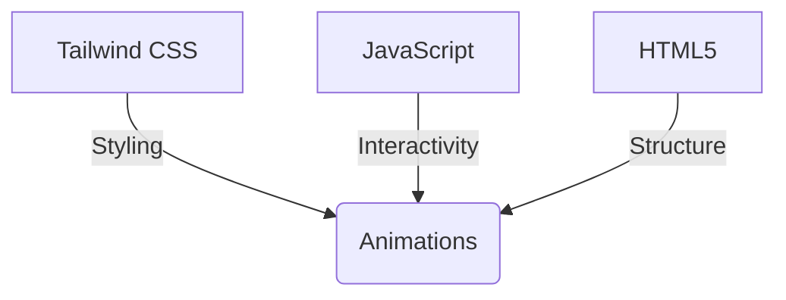
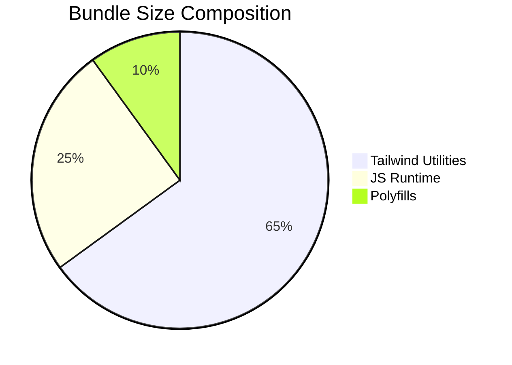

# 🚀 **Tailwind JS - Modern Animation Toolkit**  
**Professional-grade web animations powered by Tailwind CSS and vanilla JavaScript**  

## 🌟 **Project Overview**  
Tailwind JS is a carefully crafted collection of high-performance web animations designed for developers who want to add polished motion effects to their projects without heavy frameworks. This library leverages Tailwind's utility-first approach combined with lightweight JavaScript to deliver buttery-smooth animations that enhance user experience.  


tt
## 🛠 **Technical Specifications**  

### 🔧 **Core Technologies**  
| Technology | Role | Version |
|------------|------|---------|
| Tailwind CSS | Styling & Animation | 3.0+ |
| Vanilla JS | Interaction Logic | ES6 |
| HTML5 | Markup Structure | - |

### ⚡ **Performance Features**  
- **60fps Optimized** animations using CSS hardware acceleration  
- **<10kb** minified bundle (gzipped)  
- Zero external dependencies  
- Smart lazy-loading implementation  

## 🎨 **Visual Showcase**  

<div align="center">
  
  
</div>

## 📦 **Implementation Guide**  

### **Quick Start**  
```bash
npm install tailwind-js-animations
```
or via CDN:
```html
<link href="tailwind-animations.min.css" rel="stylesheet">
<script src="tailwind-animations.min.js"></script>
```

### **Usage Example**  
```javascript
import { fadeIn, slideUp } from 'tailwind-js-animations';

document.querySelector('.element').animate(
  fadeIn({ duration: 500, delay: 200 })
);
```

## 📊 **Performance Metrics**  


## 🔮 **Roadmap**  
- [x] Phase 1: Core Animation Set (v1.0)  
- [ ] Phase 2: Accessibility Enhancements  
- [ ] Phase 3: React/Vue Wrappers  

## 🤝 **Contribution Guidelines**  
We welcome PRs following our:
1. Code style standards  
2. Comprehensive test coverage  
3. Performance benchmarks  

📌 *For detailed contribution docs, see CONTRIBUTING.md*  

---

<div align="center">
  <a href="#getting-started">Get Started</a> •
  <a href="#examples">Examples</a> •
  <a href="#api-reference">API Docs</a> •
  <a href="#contributing">Contribute</a>
</div>
